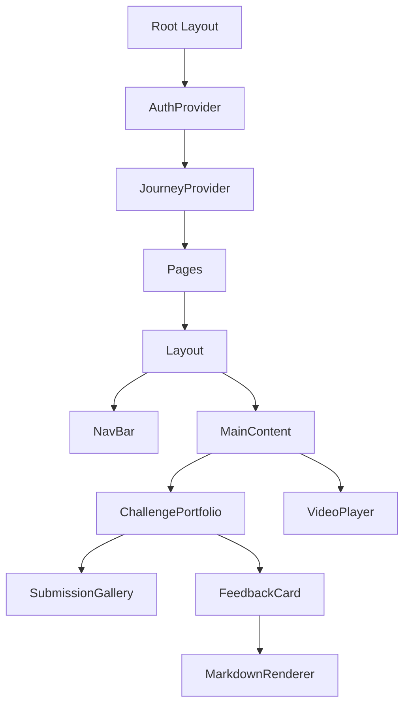

# Frontend Current Status: Tutorial Platform

## Architecture Overview
The frontend is built with **Next.js 16** and **React 19**, utilizing the **App Router** and a structure inspired by **Clean Architecture** or **Hexagonal Architecture**.

### Directory Structure
- `src/app`: Page routing and layouts.
- `src/components`: UI components (e.g., `ChallengePortfolio`, `VideoPlayer`).
- `src/services`: API client logic.
- `src/context`: State management (Auth, Journey).
- `src/adapters`: Interface with external systems.
- `src/types`: TypeScript definitions.

## Key Components & Flow

### 1. ChallengePortfolio (`components/ChallengePortfolio.tsx`)
- **Purpose**: Displays a user's challenge history and tutor feedback.
- **Data Fetching**: Calls `GET /api/users/{id}/journeys/gyms/challenges/records`.
- **Features**:
    - Timeline view of submissions.
    - Image gallery with zoom capabilities (for UML diagrams).
    - Markdown rendering for tutor feedback.
    - Skill rating visualization (Radar/Matrix style based on OOA/OOD/OOP).

### 2. Journey Subsystem (`app/(public)/journeys`)
- **Unified Routing**: Consolidated `journeys` under `(public)` to prevent Next.js 404 route collisions and share global Context smoothly.
- **Dynamic Routing**: Uses `[slug]` for different learning paths.
- **Immersive Full-Screen**: Pages like `roadmap` and `lessons` use dynamic layout toggles to hide the Sidebar for focused, immersive viewing while retaining global App contexts.
- **Gyms & SOPs**: Sub-routes for specific exercise areas.

### 3. Onboarding Subsystem (`components/layout/OnboardingOverlay.tsx`)
- **Purpose**: First-time user guidance, role identification, and Demo Simulation helper.
- **Flow**: Role Selection -> 6-step Guided Tour.
- **Role Sync**: Captures user role (HR/Tech Lead/etc.) and syncs with `Member` profile in backend.
- **Desktop Sprite (Spirit / Waterball Fairy)**: Persistent floating helper for revisiting guide content, now strictly bounded by its icon bounds to prevent accidental hover expansion. It also provides tools to trigger `Demo Mode` backend endpoints (auto-completing gyms and missions).

### 4. Auth & Logout mechanism
- **Absolute Logout**: Implemented a multi-layer cleanup (clearing `localStorage`, invalidating server session, and injecting expired `JSESSIONID` cookies).
- **Session Management**: REST-friendly logout endpoint at `/api/auth/logout`.

## Component Relationship Diagram

## Tech Stack
- **Framework**: Next.js 16 (App Router)
- **Styling**: Tailwind CSS 4
- **Icons**: Lucide React
- **Markdown**: react-markdown
- **Media**: react-youtube, react-player
- **Notifications**: Sonner
