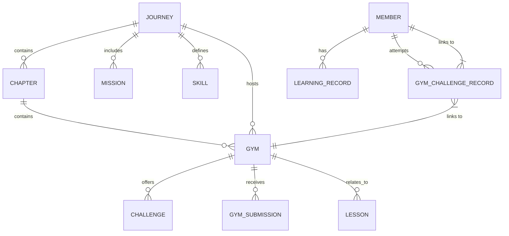

# Backend Current Status: Tutorial Platform

## Architecture Overview
The backend is a **Java Spring Boot** application using **JPA/Hibernate** for persistence. It follows a standard Layered Architecture: **Controller -> Service -> Repository -> Entity**.

## Data Model (ER Relationship)

### Key Entities
- **Member**: Stores user profile, `exp`, `coin`, `level`, and `jobTitle` (Role: HR, Tech Lead, etc.).
- **Journey**: High-level learning path (e.g., "Software Design Patterns"). Tracks `slug`, `missions`, and `skills`.
- **Gym**: A practice station within a journey. Contains challenges and rewards (`exp`, `coin`).
- **GymChallengeRecord**: Tracks a member's progress on a specific gym challenge.
    - **JSON Storage**: Uses `jsonb` to store dynamic `ratings` (skill scores) and `submission` details (image URLs, code links).
- **Skill**: Defines the skill dimensions for a journey (e.g., OOA, OOD).

## API Endpoints
- **GymChallengeRecordController**: `GET /api/users/{userId}/journeys/gyms/challenges/records` - Main endpoint for portfolio data.
- **GymController**: Management of gym metadata.
- **MemberController**: 
    - `GET /api/users/{userId}`: User profile.
    - `PATCH /api/users/{userId}`: Update profile (e.g., jobTitle/role).
    - `GET /api/leaderboard`: Leaderboard data.
- **JourneyController**: Retrieval of journey structure.

## Tech Stack
- **Language**: Java
- **Framework**: Spring Boot, Spring Data JPA
- **Database**: PostgreSQL (implied by `jsonb` usage)
- **Utilities**: Lombok, Jackson
