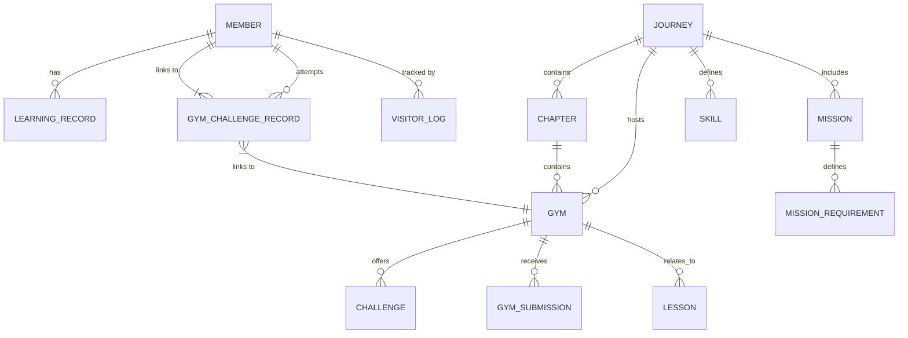

# Backend Current Status: Tutorial Platform

## Architecture Overview
The backend is a **Java Spring Boot** application using **JPA/Hibernate** for persistence. It follows a standard Layered Architecture: **Controller -> Service -> Repository -> Entity**.

## Data Model (ER Relationship)

### Key Entities
- **Member**: Stores user profile, `exp`, `coin`, `level`, and `jobTitle`. Added fields for `githubUrl` and `discordId`.
- **VisitorLog**: Tracks guest/visitor activity prior to registration.
- **Mission**: Defines specific goals within a Journey, evaluated by `ConditionEvaluator`.
- **MissionRequirement**: Stores criteria (e.g., `GYM_CHALLENGE_SUCCESS`) and pre-requisites (`PREREQUISITE`), explicitly querying via `targetGymId` or `targetMissionId` for sequential unlocking logic.

## API Endpoints
- **Auth**: `/api/auth/register`, `/api/auth/quick-register`, `/api/auth/logout`.
- **GymChallengeRecordController**: `GET /api/users/{userId}/journeys/gyms/challenges/records`.
- **MissionController**: `POST /api/missions/{id}/accept`.
- **MemberController**: 
    - `GET /api/users/{userId}`: User profile.
    - `PATCH /api/users/{userId}`: Update profile (e.g., jobTitle/role).
    - `GET /api/leaderboard`: Leaderboard data.
- **DemoController**: Helper endpoints for hybrid demo simulations (e.g., `POST /api/demo/complete-current-gym`, `POST /api/demo/complete-current-mission`).

## Tech Stack
- **Language**: Java
- **Framework**: Spring Boot, Spring Data JPA
- **Database**: PostgreSQL (implied by `jsonb` usage)
- **Utilities**: Lombok, Jackson
