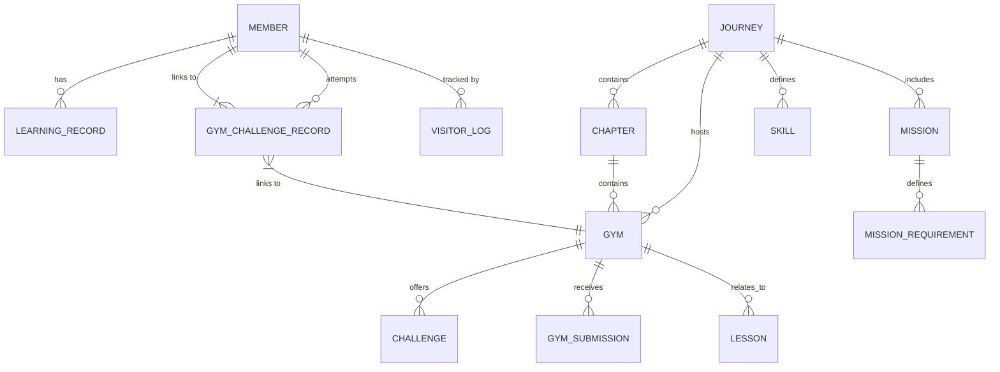

# Backend Current Status: Tutorial Platform

## Architecture Overview (架構概位) <!-- id: SD-01 --> [Phase 1 Implementation]
The backend is a **Java Spring Boot** application using **JPA/Hibernate** for persistence. It follows a standard Layered Architecture: **Controller -> Service -> Repository -> Entity**.

## Data Model (ER Relationship) (資料模型) <!-- id: SD-02 --> [Phase 1 Implementation]

### Key Entities
- **Member**: Stores user profile, `exp`, `coin`, `level`, and `jobTitle`. Added fields for `githubUrl` and `discordId`.
- **VisitorLog**: Tracks guest/visitor activity prior to registration.
- **Mission**: Defines specific goals within a Journey, evaluated by `ConditionEvaluator`.
- **MissionRequirement**: Stores criteria (e.g., `GYM_CHALLENGE_SUCCESS`) and pre-requisites (`PREREQUISITE`), explicitly querying via `targetGymId` or `targetMissionId` for sequential unlocking logic. Validated in `import_javascript_140.sql`. <!-- id: SD-03.1 --> [Phase 3 Implementation]
- **Challenge State Machine (挑戰狀態機)**: <!-- id: SD-03.2 --> [Phase 3 Implementation]
  - **Flow**: `STARTED` (Booked/Timer active) -> `SUBMITTED` (Homework files uploaded) -> `REVIEWING` (Tutor feedback pending) -> `PASSED/SUCCESS`.
  - **流程**：`STARTED` (已預約/開啟計時) -> `SUBMITTED` (已繳交作品) -> `REVIEWING` (導師批改中) -> `PASSED/SUCCESS` (通關)。
  - **Implementation**: Syncs with `GymChallengeRecord.java` enum and `ChallengeModal.tsx` display logic.
- **LessonContent**: Associated with `Lesson`, loaded manually into `LessonDTO` containing the media URL and Video ID mapped against the video type.

## API Endpoints & Security Config
- **Auth**: `/api/auth/register`, `/api/auth/quick-register`, `/api/auth/logout`.
- **GymChallengeRecordController**: `GET /api/gym-challenge-records/me` (whitelisted as `permitAll()` to fail silently without 401 triggers).
- **MissionController**: `POST /api/missions/{id}/accept`.
- **MemberController**: 
    - `GET /api/users/{userId}`: User profile.
    - `PATCH /api/users/{userId}`: Update profile (e.g., jobTitle/role).
    - `GET /api/leaderboard`: Leaderboard data.
- **GymController**: 
    - `GET /api/gyms/{id}`: Returns `GymDetailDTO`. **[Update]**: Enhanced structural mapping to extract `lesson.getContents()` resolving missing Video URLs on the client.
- **OrderController**:
    - `POST /api/orders`: Secured/Whitelisted endpoints allowing order transactions directly without strict auth requirements breaking checkout mocks.
- **DemoController**: Helper endpoints for hybrid demo simulations (e.g., `POST /api/demo/complete-current-gym`, `POST /api/demo/complete-current-mission`).

### JWT Security Configuration (`SecurityConfig.java`) <!-- id: SD-04 --> [Phase 1 Implementation]
Strict mapping blocks any unauthorized POST/GET action. Must use `.requestMatchers("<path>").permitAll()` explicitly for newly introduced frontend features (e.g., checking challenge records across the roadmap map autonomously).

## Tech Stack
- **Language**: Java
- **Framework**: Spring Boot, Spring Data JPA
- **Database**: PostgreSQL (implied by `jsonb` usage)
- **Utilities**: Lombok, Jackson
